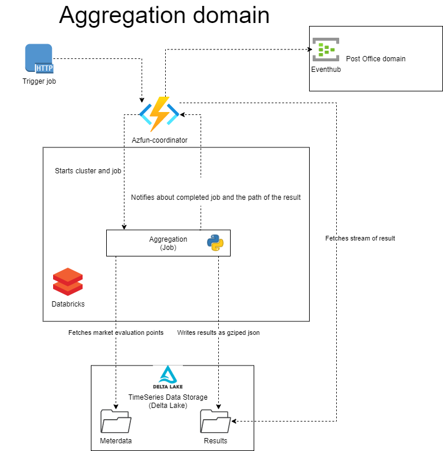

# Aggregations

## Intro

The aggregation domain is in charge of doing calculations on the time series sent to Green Energy Hub and executing the balance and wholesale settlement process.

The main calculations the domain is responsible to process are consumption, production, exchange between grid areas and the current grid loss within a grid area.  
All calculations return a result for grid area, balance responsible and energy supplier.

The times series sent to Green Energy Hub is processed and enriched in the [time series domain](https://github.com/Energinet-DataHub/geh-timeseries) before they can be picked up by the aggregation domain.

The calculated results are packaged and forwarded to the legitimate recipients such as:

| Recipients |
| ----------- |
| Grid company  |
| Balance supplier |
| Energy supplier |

These are the business processes maintained by this domain:

| Processes |
| ----------- |
| [Submission of calculated energy time series](./docs/business-processes/submission-of-calculated-energy-time-series.md) |
| [Request for historical data](./docs/business-processes/request-for-historical-data.md) |
| [Request for calculated energy time series](./docs/business-processes/request-for-calculated-energy-time-series.md) |
| [Aggregation of wholesale services](./docs/business-processes/aggregation-of-whole-sale-services.md) |
| [Request for aggregated tariffs](./docs/business-processes/request-for-aggregated-tariffs.md) |
| [Request for aggregated subscriptions or fees](./docs/business-processes/request-for-aggregated-subscriptions-or-fees.md) |
| [Request for settlement basis](./docs/business-processes/request-for-settlement-basis.md) |

## Architecture



## Dataflow between domains

---

## How do we do aggregations?

The aggregations/calculations of the market evaluation points stored in the delta lake are done by databricks jobs containing
python code utilizing [pyspark](https://databricks.com/glossary/pyspark).

### Coordinator function

The coordinator has a descriptive name in the sense that it does what it says on the tin.
It allows an external entity to trigger an aggregation job via a http interface.

[Peek here to see we start and manage databricks from the coordinator](https://github.com/Energinet-DataHub/geh-aggregations/blob/d7750efc6a3c172a0ea69775fa5a157ecd4c9481/source/coordinator/GreenEnergyHub.Aggregation.Application/Coordinator/CoordinatorService.cs#L64)
Once the calculations are done the databricks jobs sends the results back to the coordinator for further processing.

### Databricks workspace

This is the instance in which the databricks cluster resides.
(TBD) When the instance is in the shared domain, describe that.

### Databricks cluster

The databricks cluster is configured via [a specific workflow](./.github/workflows/aggregation-job-infra-cd.yml) that picks up the [generated wheel file](./.github/workflows/build-publish-wheel-file.yml) containing the code for the aggregations. This wheel file is installed as a library allowing all the workers in the cluster to use that code.

### Python code

The aggregation job itself is defined by python code. The code is both compiled into a wheel file and a python file triggered by the job.
The starting point for the databricks job is in [./source/databricks/aggregation-jobs/aggregation_trigger.py](./source/databricks/aggregation-jobs/aggregation_trigger.py)
The specific aggregations in [.\source\databricks\geh_stream\aggregation_utils\aggregators](./source/databricks/geh_stream/aggregation_utils/aggregators) these are compiled into a wheel file and installed as a library on the cluster.

### Dataframe results

The results of the aggregation [dataframes](https://databricks.com/glossary/what-are-dataframes) are combined in [aggregation_trigger.py](./source/databricks/aggregation-jobs/aggregation_trigger.py) and then sent back to the coordinator as json.

---

## Input into the aggregation domain

### Delta lake (market evaluation points)

The aggregation domain does its calculation on data residing in a delta lake. This data is read in in the beginning of the aggregation job and used through out the calculations
[See here how we read the data in the python code](./source/databricks/geh_stream/aggregation_utils/aggregators/aggregation_initializer.py)
(TBD) Reading historical data.

### Eventhub input

(TBD)

---

## Output from the aggregation domain

The coordinator has the responsibility for sending results from the aggregation jobs out of the aggregation domain.
It collects the result from the job in the [CoordinatorService](https://github.com/Energinet-DataHub/geh-aggregations/blob/954583a83fcd832fed3688e5201d15db295bdfb1/source/coordinator/GreenEnergyHub.Aggregation.Application/Coordinator/CoordinatorService.cs#L129) handles it and sends it out to a destination eventhub. This is the current implementation. But results could easily be send to another type of endpoint.

### Format of the message

(TBD)

### Talking to the postoffice eventhub endpoint via the messaging framework

(TBD) Link to the framework once it has been moved. Right now it is embedded as projects.

### Protobuf

(TBD) Link to general description of the use of protobuf.

---

## Getting started

- As a general approach for getting started with aggregation we recommend setting up the infrastructure and familiarize yourself with
the components involved and how to get into your [databricks workspace](https://docs.databricks.com/getting-started/quick-start.html).
- [Generate some test data](#Generating-test-data) so you have something to calculate on top of.
- Finally: try and do some calculations by [triggering the jobs](#Triggering-aggregations-via-coordinator).

### Setting up infrastructure

The instances able to run the aggregations are created with infrastructure as code (Terraform). The code for this can be found in
[./build](./build).
This IaC is triggered by github and the following describes how to get started with provisioning your own infrastructure.

(TBD) Link the general description of how Terraform and IaC works.

(TBD) Info about the shared resources and the role of the keyvault.

(TBD) Info about environments.

### [Read more on aggregation infrastructure](./docs/setting-up-infrastructure.md)

---

## Test

Link to test.md.

### Generating test data

### How can you generate test data in your delta lake

## Triggering aggregations via coordinator

An example:

```URL

https://azfun-coordinator-aggregations-XXXXXX.azurewebsites.net/api/KickStartJob?beginTime=2013-01-01T23%3A00%3A00%2B0100&endTime=2013-01-30T23%3A00%3A00%2B0100&processType=D03
```

This will ask the coordinator to do an aggregation in the specified time frame with process type D03.

## Viewing results of aggregations

If you are using this domain without having a target eventhub for handling the results an alternative approach would be to change [CoordinatorService](https://github.com/Energinet-DataHub/geh-aggregations/blob/954583a83fcd832fed3688e5201d15db295bdfb1/source/coordinator/GreenEnergyHub.Aggregation.Application/Coordinator/CoordinatorService.cs#L129) and then perhaps either:

- Dump the result into a file and the inspect it.
- Log it into application log.
- Perhaps send it elsewhere.
