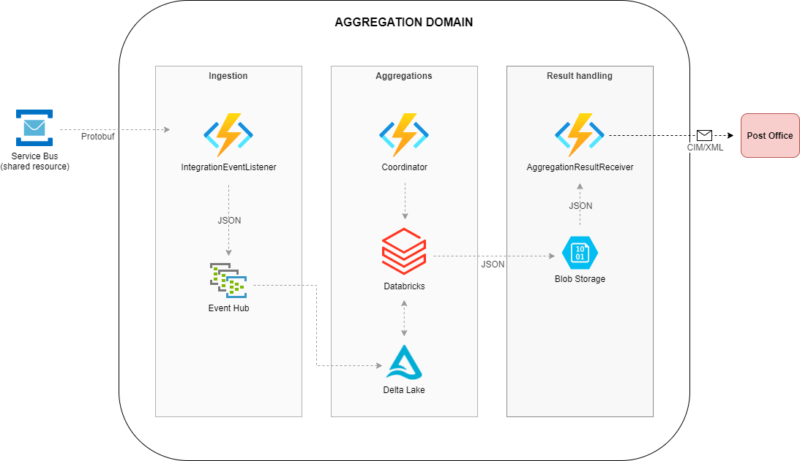

# Obsolete

### This repository is obsolete. It is no longer being actively maintained by the organisation.

### The work/domain has been superseeded by [the wholesale repository/domain](/Energinet-DataHub/opengeh-wholesale).

# Aggregations

[](https://codecov.io/gh/Energinet-DataHub/geh-aggregations)

[](https://sonarcloud.io/dashboard?id=geh-aggregations-python)

[](https://sonarcloud.io/dashboard?id=geh-aggregations-dotnet)

## Table of content

* [Intro](#intro)
* [Architecture](#architecture)
* [Domain Road Map](#domain-road-map)
* [Dataflow between domains](#dataflow-between-domains)
    * [Input into the aggregations domain](#input-into-the-aggregations-domain)
        * [Delta Lake (metering points)](#delta-lake-metering-points)
        * [Eventhub input](#eventhub-input)
    * [Output from the aggregations domain](#output-from-the-aggregations-domain)
        * [Format of the message](#format-of-the-message)
        * [Talking to the postoffice eventhub endpoint via the messaging framework](#talking-to-the-post-office-eventhub-endpoint-via-the-messaging-framework)
        * [Protobuf](#protobuf)
* [How do we do aggregations?](#how-do-we-do-aggregations)
    * [Coordinator function](#coordinator-function)
    * [Databricks workspace](#databricks-workspace)
    * [Databricks cluster](#databricks-cluster)
    * [Python code](#python-code)
    * [Dataframe results](#dataframe-results)
* [Getting started](#getting-started)
    * [Setting up infrastructure](#setting-up-infrastructure)
    * [Read more on aggregations infrastructure](#read-more-on-aggregations-infrastructure)
* [Test](#test)
    * [Generating test data](#generating-test-data)
    * [How can you generate test data in your Delta Lake](#how-can-you-generate-test-data-in-your-delta-lake)
* [Triggering aggregations via coordinator](#triggering-aggregations-via-coordinator)
* [Viewing results of aggregations](#viewing-results-of-aggregations)

## Intro

The aggregation domain is in charge of doing calculations on the time series sent to Green Energy Hub and executing the balance and wholesale settlement process.

The main calculations the domain is responsible to process are consumption, production, exchange between grid areas and the current grid loss within a grid area.  
All calculations return a result for grid area, balance responsible parties and energy suppliers.

The times series sent to Green Energy Hub is processed and enriched in the [Time Series domain](https://github.com/Energinet-DataHub/geh-timeseries) before they can be picked up by the Aggregations domain.

The calculated results are packaged and forwarded to the legitimate Market Participants such as:

| Market Participants |
| ----------- |
| Grid Access Provider  |
| Balance Responsible Party |
| Energy Supplier |

These are the business processes maintained by this domain:

| Processes |
| ----------- |
| [Submission of calculated energy time series](docs/business-processes/submission-of-calculated-energy-time-series.md) |
| [Request for calculated energy time series](docs/business-processes/request-for-calculated-energy-time-series.md) |
| [Aggregation of wholesale services](docs/business-processes/aggregation-of-wholesale-services.md) |
| [Request for aggregated subscriptions or fees](docs/business-processes/request-for-aggregated-subscriptions-or-fees.md) |
| [Request for aggregated tariffs](docs/business-processes/request-for-aggregated-tariffs.md) |
| [Request for settlement basis](docs/business-processes/request-for-settlement-basis.md) |

## Domain Overview



## Domain Road Map

In the current [program increment](https://www.scaledagileframework.com/program-increment/) we are working on the following features:

* Deliver a calculation engine that calculates quantities, amounts and get prices per charge on flex settled metering points,  so that we can execute wholesale fixing (D05) and correction settlement (D32)
* We store calculation results, so we can prepare for reporting to the post office, and for later use eg. requests of aggregated data from market actors
* We store basis data for wholesale fixing (D05) and correction settlement (D32), so we can support future control reports
* We can trigger a wholesale fixing (D05) and correction settlement process (D32) for all variants
* Protobuf contract for create event between timeseries and aggregation domain is created, so that we can implement realistic mock data, to ease the integration process later
* We will make it possible for SME's to trigger a process and view the results, so the business gets involved in the validating the solution.

## Dataflow between domains


### Input into the aggregations domain

#### Delta Lake (metering points)

The Aggregations domain does its calculation on data residing in a delta lake. This data is read in in the beginning of the aggregation job and used through out the calculations.
[See here how we read the data in the python code](source/databricks/geh_stream/aggregation_utils/aggregators/aggregation_initializer.py)

(TBD) Reading historical data.

#### Eventhub input

(TBD)

---

### Output from the aggregations domain

The coordinator has the responsibility for sending results from the aggregation jobs out of the Aggregations domain.
It collects the result from the job in the [CoordinatorService](source/coordinator/Energinet.DataHub.Aggregation.Coordinator.Application/Coordinator/CoordinatorService.cs) handles it and sends it out to a destination eventhub. This is the current implementation. But results could easily be send to another type of endpoint.

#### Format of the message

(TBD)

#### Talking to the Post Office eventhub endpoint via the messaging framework

(TBD) Link to the framework once it has been moved. Right now it is embedded as projects.

### Protobuf

(TBD) Link to general description of the use of protobuf.

---

## How do we do aggregations?

The aggregations/calculations of the metering points stored in the delta lake are done by databricks jobs containing
python code utilizing [pyspark](https://databricks.com/glossary/pyspark).

### Coordinator function

The coordinator has a descriptive name in the sense that it does what it says on the tin.
It allows an external entity to trigger an aggregation job via an http interface.

[Peek here to see we start and manage databricks from the coordinator](source/coordinator/Energinet.DataHub.Aggregation.Coordinator.Application/Coordinator/CoordinatorService.cs)
Once the calculations are done the databricks job notifies the coordinator about the path of the result.
The coordinator receives the path in Coordinatortriggers/ResultReceiver and from there the CoordinatorService fetches a stream of the result that the databricks
job put in the blob. The format of the result is JSON which is gzip compressed.
The stream is decompressed before the input is further processed.
The inputprocessor finds a strategy that matches the name of the aggregation result and hands over the next steps to the strategy.

#### Implementing aggregation result strategies

The coordinator utilizes a strategy pattern for handling different results returned from the databricks job.
The strategy is matched by the name of the result in the blob path returned.(See InputStringParserTest)

To implement a new strategy use the following approach:

```C#
public class YourResultDtoStrategy: BaseStrategy<YourResultDto>, IDispatchStrategy

public YourResultDtoStrategy(
            ILogger<YourResultDto> logger,
            Dispatcher dispatcher)
        : base(logger, dispatcher)
        {
        }

public override string FriendlyNameInstance => "your_result";

public override IEnumerable<IOutboundMessage> PrepareMessages(
            IEnumerable<YourResultDto> list,
            ProcessType processType,
            string timeIntervalStart,
            string timeIntervalEnd)
        {
            // Code for transforming list of YourResultDtos to IEnumerable<IOutboundMessage>
        }
```

Your Strategy is automatically DI registered during startup and will then be called when YourResult is received.
If the system can't find an appropriate strategy it will log it with the following message:

__IDispatchStrategy not found in input processor map. your_result___

---

### Databricks workspace

This is the instance in which the databricks cluster resides.
(TBD) When the instance is in the shared domain, describe that.

### Python code

The aggregation job itself is defined by python code. The code is both compiled into a wheel file and a python file triggered by the job.
The starting point for the databricks job is in [aggregation_trigger.py](source/databricks/aggregation-jobs/aggregation_trigger.py)
The specific aggregations in [.\source\databricks\geh_stream\aggregation_utils\aggregators](source/databricks/geh_stream/aggregation_utils/aggregators) these are compiled into a wheel file and installed as a library on the cluster.

### Dataframe results

The results of the aggregation [dataframes](https://databricks.com/glossary/what-are-dataframes) are combined in [aggregation_trigger.py](source/databricks/aggregation-jobs/aggregation_trigger.py) and then sent back to the coordinator as json.

---

## Getting started

* As a general approach for getting started with aggregations we recommend setting up the infrastructure and familiarize yourself with
the components involved and how to get into your [databricks workspace](https://docs.databricks.com/getting-started/quick-start.html).
* [Generate some test data](#Generating-test-data) so you have something to calculate on top of.
* Finally: try and do some calculations by [triggering the jobs](#Triggering-aggregations-via-coordinator).

### Setting up infrastructure

The instances able to run the aggregations are created with infrastructure as code (Terraform). The code for this can be found in
[./build](build).
This IaC is triggered by github and the following describes how to get started with provisioning your own infrastructure.

__Note:__ We use a delta lake for the time series data which is not currently commissioned  by the IaC. You need to setup and reference one yourself.

(TBD) Link the general description of how Terraform and IaC works.

(TBD) Info about the shared resources and the role of the keyvault.

(TBD) Info about environments.

### Read more on aggregations infrastructure

Learn more about the aggregations infrastructure [here](docs/setting-up-infrastructure.md).

---

## Test

Read about general QA that applies to the entire Green Energy Hub [here](https://github.com/Energinet-DataHub/green-energy-hub/blob/main/docs/quality-assurance-and-test.md).

The aggregation domain has [Databricks](https://databricks.com/) jobs and libraries implemented in Python. Currently, the aggregation domain has a test suite of [pytest](https://pytest.org/) unit tests. Information about and instructions on how to execute these tests are outlined [here](source/databricks/readme.md).

### Generating test data

The time series test data is created using the [databricks workbook](source/databricks/test_data_creation/time_series_test_data_creator.ipynb).

The creation of test data is based on [this file](source/databricks/test_data_creation/test_data_csv.csv) generated from the current danish DataHub system. The test data file consists of the following data properties:

| Data properties | Description |
| ----------- | ----------- |
| GridArea |  |
| Supplier | Energy supplier |
| Type_Of_MP | Type of metering point eg. production, consumption, exchange |
| Physical_Status | Status of metering point eg. new, connected, disconnected |  
| Settlement_Method | Consumption based property to indicate if time series value is flex or hourly based |
| Reading_Occurrence | Resolution eg. 1 hour, 15 minutes etc. |
| Count |  Represents count of data entries having identical configuration |
| FromGridArea | Related to exchange to specify time series exiting the grid area |
| ToGridArea | Related to exchange to specify time series entering the grid area |
| BRP | Balance Responsible Party |

### How can you generate test data in your Delta Lake

The [databricks workbook](source/databricks/test_data_creation/time_series_test_data_creator.ipynb) can be used to generate the amount of data needed and is currently configured to create time series data for more than 50 grid areas and approximately 4 million metering points.

The creation of test data is split into two parts:

 1. Create test data based on [this file](source/databricks/test_data_creation/test_data_csv.csv) for one hour based on old school iteration that takes a while.
 2. Create test data based on latest one full hour loaded as dataframe from Delta Lake.

The reason for the split of data creation is to take full advantage of the distributed architecture of Spark and Delta Lake.

The generated time series data are setup to be stored in a delta lake where from the [aggregation job](source/databricks/aggregation-jobs/aggregation_trigger.py) fetches the data to run an aggregation upon.

If test data is created solely based on [this file](source/databricks/test_data_creation/test_data_csv.csv), then the data stored will amount to approximately 202.574.280 entries per day resulting in about 2.16 GB of storage.

## Triggering aggregations via coordinator

An example:

```URL

https://azfun-coordinator-aggregations-XXXXXX.azurewebsites.net/api/KickStartJob?beginTime=2013-01-01T23%3A00%3A00%2B0100&endTime=2013-01-30T23%3A00%3A00%2B0100&processType=D03
```

This will ask the coordinator to do an aggregation in the specified time frame with process type D03.

## Viewing results of aggregations

If you are using this domain without having a target eventhub for handling the results an alternative approach would be to change [CoordinatorService](source/coordinator/Energinet.DataHub.Aggregation.Coordinator.Application/Coordinator/CoordinatorService.cs) and then perhaps either:

* Dump the result into a file and the inspect it.
* Log it into application log.
* Perhaps send it elsewhere.
