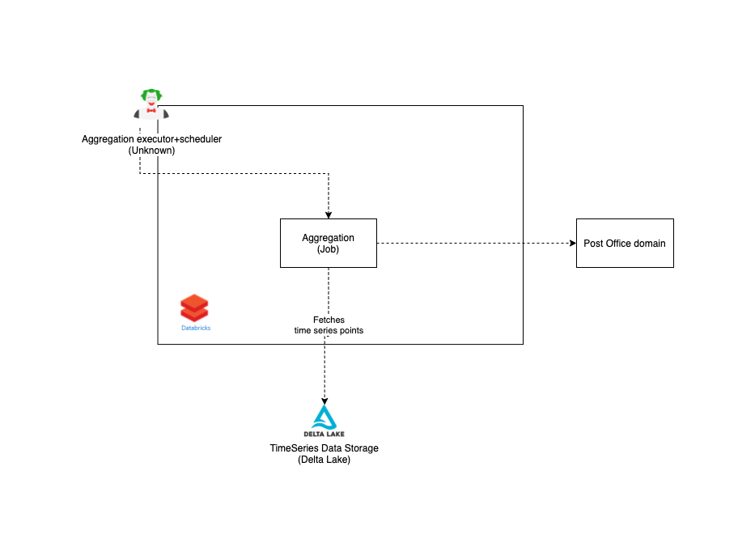

# Aggregations

## Intro

This should be replaced by content that fits your domain.

## Architecture

## Dataflow bewteen domains

## How do I get started?

### Installation

### Usage

## Where can I get more help?

Code owners? Gitter versus Slack? Referral to geh_repo?

## Repository origin

This repository was created using the Green Energy Hub template.

Please read the [template documentation](./docs/template-readme/README.md) for details and introduction to the template.
